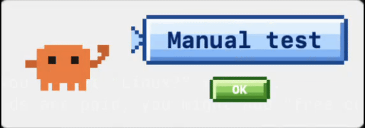

# CLINotify

[](https://github.com/ZichengWangdrzz/clinotify/releases/latest)
[](https://github.com/ZichengWangdrzz/clinotify/releases)
[](#requirements)
[](LICENSE)
[](https://x.com/devpsycho_ai)

> Native macOS menu-bar helper that pops a desktop toast — a waving pixel-art crab, a speech bubble with the project/session name, and a sound — the moment your CLI coding agent finishes a task or needs your input.

CLINotify watches **Claude Code** sessions and tells you when they're done or waiting on you, so you can step away without babysitting the terminal. The toast is a screen-corner window, so it works in **every** terminal — Ghostty, iTerm2, Apple Terminal, kitty, WezTerm, the VS Code terminal, and inside tmux — because it never targets the terminal itself.

> [!IMPORTANT]
> **Codex is not supported yet.** CLINotify currently supports **Claude Code only** — Codex support is on the way.

- One toast per session. Set it up once; new sessions auto-register.
- Click the toast to dismiss. On Claude Code it also auto-dismisses when you start typing again.
- Menu-bar only — no Dock icon.
- Free core experience. Some skins/sounds are paid (commercial product, Lemon Squeezy licensing).

## Demo



▶ Watch it with sound on the [website](https://zichengwangdrzz.github.io/clinotify/#demo).

## Install

### Homebrew (cask)

```sh
brew install --cask ZichengWangdrzz/clinotify/clinotify
```

### Direct download

1. Download `CLINotify.dmg` from the [Releases](https://github.com/ZichengWangdrzz/clinotify/releases) page.
2. Open the DMG and drag **CLINotify** to `/Applications`.

Release builds are signed and notarized by Apple, so Gatekeeper opens them normally. (If you ever run an unsigned **local** build, right-click the app → **Open** the first time.)

## Update

```sh
brew update && brew upgrade --cask clinotify
```

Your hooks, skins, sounds and settings all **survive upgrades** — no reconfiguration needed.

- **Keep `clinotify autostart on`** (recommended): the new version relaunches itself the moment the upgrade finishes — nothing else to do.
- No autostart? Run `clinotify launch` once after upgrading.
- **Upgrading from v0.1.0 / v0.1.1:** run `clinotify install` once after the upgrade (one-time hook migration to absolute paths), and expect a single password prompt during that one upgrade.

## First run / setup

1. Launch **CLINotify** from `/Applications`. It lives in the menu bar (look for the **CLI** item) — there is no Dock icon.
2. Open the menu → **Install Hooks** (or run `clinotify install` from a terminal).
3. That's it. Start a Claude Code session as usual; CLINotify registers it and toasts you when the agent finishes or needs input.

## Usage

The bundled CLI is `clinotify`. The commands you actually type:

```sh
clinotify install            # install the CLI + Claude Code hooks
clinotify launch             # start the menu-bar app
clinotify autostart on       # keep it running across logout/reboot (off | status)
clinotify test               # fire a test "done" toast (try "attention" too)
clinotify status             # channel, helper state, and paths
clinotify list               # registered sessions
clinotify settings           # show every effective setting
clinotify uninstall          # remove the hooks
```

Run `clinotify help` for the full list, or `clinotify help --all` to also see the
hook commands that `install` wires up for you.

### Skins

Four independent skin axes. Run a verb with **no value** to list the options
(free / paid / owned); pass an **id** to select it:

```sh
clinotify animation [<id>]   # the crab animation        (right-hand-wave, squint-leg-wave)
clinotify bubble    [<id>]   # the speech-bubble style    (windows-xp, classic-pixel)   — alias: skin
clinotify sound     [<id>]   # the notification sound     (glass, ping, submarine, arcade-chime)
```

Some skins/sounds are paid; locked ones show as `locked` until purchased.

### Tweaks

```sh
clinotify background [on|off]    # show/hide the card behind the toast
clinotify mute [on|off|toggle]   # mute this terminal's sound
clinotify scale [50%-200%]       # toast size
clinotify alerts [on|off]        # master on/off for all toasts
clinotify license                # license status (status | activate-local <key> | reset)
```

## Requirements

- macOS 13 (Ventura) or later.

## Build from source

```sh
swift build
swift test
./scripts/build-app-bundle.sh          # → .build/app/CLINotify.app
open .build/app/CLINotify.app
```

## Development / dev channel

CLINotify ships two build channels that run **side by side** without colliding:

| Channel    | App                 | CLI            | State dir                                          | Bundle id                 |
|------------|---------------------|----------------|----------------------------------------------------|---------------------------|
| production | `CLINotify.app`     | `clinotify`    | `~/Library/Application Support/CLINotify/`          | `app.clinotify.helper`     |
| dev        | `CLINotify Dev.app` | `clinotify-dev`| `~/Library/Application Support/CLINotify-Dev/`      | `app.clinotify.helper.dev` |

The channel is selected by the invoked binary name (`clinotify-dev`) or by setting `CLINOTIFY_CHANNEL=dev`. Each channel has its own Unix socket and state directory, so the installed production app and a dev build can both run at once.

### Workflow: develop on dev, then promote to production

**Parity model:** there is ONE source tree (`Sources/`). `dev` and `production` are two build
*channels* of that same source — identical code, different identity (app name, bundle id, CLI name,
state dir, socket, hooks). So "keep production the same as dev" simply means **build both channels
from the same source without editing in between** — they are then byte-identical logic.

`scripts/reinstall-local.sh` is a one-command "build + (re)install a channel from the current
source": it rebuilds the `.app`, refreshes its CLI symlink + hooks, and restarts only that channel's
daemon. The restart is **autostart-aware** — if the channel is launchd-managed (`clinotify autostart
on`), it restarts via `launchctl kickstart` so the new binary is picked up without fighting
KeepAlive; otherwise it stops + `open`s the daemon manually.

```sh
# 1. Develop + test on the dev channel (separate app/CLI/state — never touches production):
CHANNEL=dev ./scripts/reinstall-local.sh
clinotify-dev test                       # fire a test toast; tweak skins; iterate

# 2. When the change is ready to push, promote the SAME source into local production
#    for a pre-push dress rehearsal (this is what a downloaded build will behave like):
./scripts/reinstall-local.sh             # CHANNEL defaults to production
clinotify test
```

Undo a channel any time with `clinotify uninstall` / `clinotify-dev uninstall`.

> Note: installing hooks for *both* channels makes a real agent session toast twice (once per
> daemon). For routine dev work, keep hooks on production only and test dev with `clinotify-dev test`;
> install dev hooks (step 1 runs `install`) just while you're testing the live hook flow, then
> `clinotify-dev uninstall`.

```sh
clinotify status        # production: its socket + state dir
clinotify-dev status    # dev: a separate socket + state dir
```

## How it works

```
agent event ──► clinotify (hook) ──► Unix socket ──► CLINotifyApp (menu-bar daemon) ──► toast
```

- `clinotify` is installed as a **hook** into Claude Code (`~/.claude/settings.json`: `Stop` / `Notification` / `UserPromptSubmit` / `SessionEnd`). (Codex wiring via `~/.codex/config.toml`: `notify` exists in the code but Codex isn't supported yet.)
- On each event the hook sends a small message over a **Unix domain socket** to the long-running menu-bar daemon (`CLINotifyApp`).
- The daemon renders the screen-corner toast, keyed by the agent's session id. Because the toast is its own window, it is **terminal-agnostic** — it never tries to attach to or draw inside any terminal.

## Release

Releases are distributed two ways from the same signed, notarized, stapled DMG:

1. A **GitHub Release** with `CLINotify.dmg` attached.
2. A **Homebrew cask** in the `ZichengWangdrzz/homebrew-clinotify` tap.

Tagging a `v*` tag triggers `.github/workflows/release.yml`, which builds, signs+notarizes, publishes the release, and generates the cask. See that workflow for the repo secrets it requires.

## Support

CLINotify is built by one indie hacker — [**@devpsycho_ai**](https://x.com/devpsycho_ai) on X. If it saves you from babysitting your terminal, you can say thanks:

> ☕ **[Buy me a coffee on Ko-fi](https://ko-fi.com/devpsycho)** — a coffee keeps the crab waving.

## License

CLINotify is licensed under the [Elastic License 2.0](LICENSE) (`Elastic-2.0`) — a source-available license. The core app is free to use, copy, modify, and redistribute. You may **not** circumvent the license-key functionality that gates paid skins/sounds, and you may not offer CLINotify as a hosted/managed service. Copyright © 2026 devpsycho.
